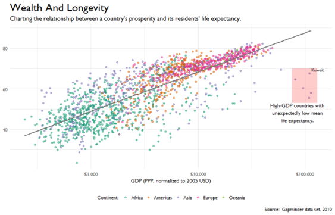
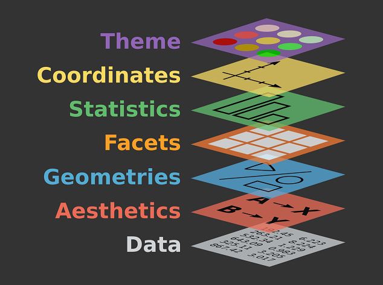
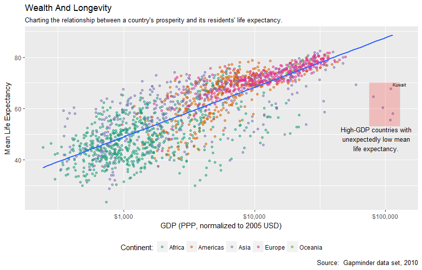
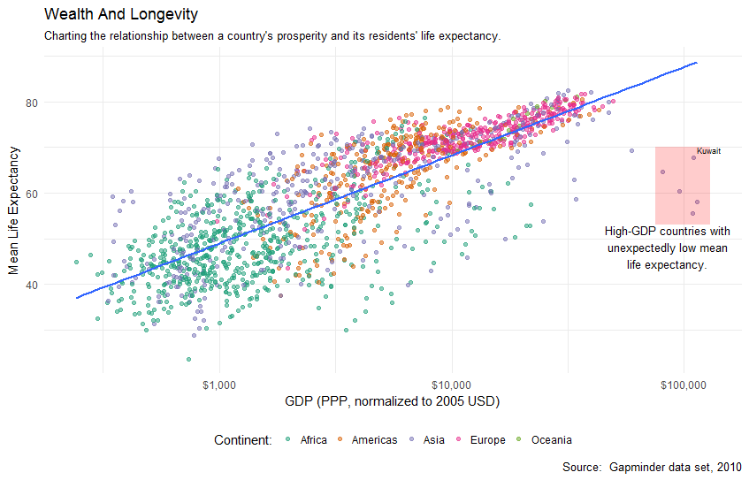
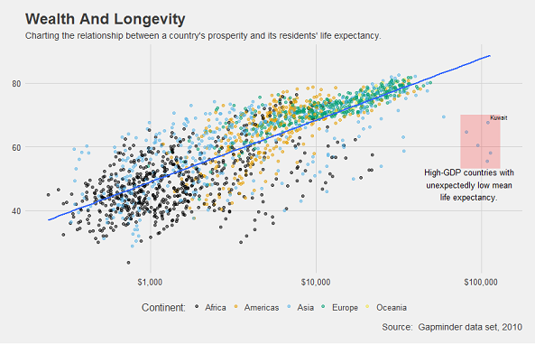

## Grokking the Grammar of Graphics

<a href="http://www.catallaxyservices.com">Kevin Feasel</a> (<a href="https://twitter.com/feaselkl">@feaselkl</a>)
<a href="https://csmore.info/on/ggplot">http://CSmore.info/on/ggplot</a>

---

@title[Who Am I?]

@snap[west splitscreen]
<table>
	<tr>
		<td></td>
		<td><a href="https://csmore.info">Catallaxy Services</a></td>
	</tr>
	<tr>
		<td></td>
		<td><a href="https://curatedsql.com">Curated SQL</a></td>
	</tr>
	<tr>
		<td></td>
		<td><a href="https://wespeaklinux.com">We Speak Linux</a></td>
	</tr>
</table>
@snapend

@snap[east splitscreen]

	
	 
	<a href="http://www.twitter.com/feaselkl">@feaselkl</a>

@snapend

---?image=presentation/assets/background/sound-mixer.jpg&size=cover&opacity=15

### Level Setting

What I expect you to know:
* R is a language focused around performing statistical analysis, predictive modeling, and data cleansing.
* R has a built-in plotting library which allows you to create rudimentary graphics.
* Those graphics tend not to look very nice.

---

### Level Setting

By the end of today's talk, we will be able to build an image with:

* Multi-colored scatter plot & regression line
* Title & subtitle, log axis, source ref, legend
* Callout box with text and single labeled point

---?image=presentation/assets/background/motivation.jpg&size=cover&opacity=15

### Motivation

My goals in this talk:

1. Introduce you to the Grammar of Graphics.
2. Introduce you to the ggplot2, an advanced library in R which implements the Grammar of Graphics.
3. Show you how to build professional-looking graphics iteratively.
4. Get you thinking about ways you could create great-looking visuals in your environment.

---

@title[Introducing the Grammar]

## Agenda
1. **Introducing the Grammar**
2. Mappings and Geoms
3. Scales and Coordinates
4. Labels and Annotations
5. Themes and Legends
6. Facets

---

### Introducing the Grammar

Leland Wilkinson wrote The Grammar of Graphics in 1999 (<a href="https://www.springer.com/us/book/9780387245447">2nd edition</a> in 2005). 

Why is this important?  Hadley Wickham explains:

@quote["A grammar provides a strong foundation for understanding a diverse range of graphics. A grammar may also help guide us on what a well-formed or correct graphic looks like, but there will still be many grammatically correct but nonsensical graphics. This is easy to see by analogy to the English language: good grammar is just the first step in creating a good sentence."]

---?image=presentation/assets/background/lego.jpg&size=cover&opacity=15

### Introducing the Grammar

The core insight behind a grammar is that a great image is composable (in the programming sense):  there are components which make up this image.  Generalizing these components lets us piece together images rather than trying to produce them fully-formed.

This lets us use a relatively small number of components to create an indefinite number of possible graphics.

---

### The Components

---?image=presentation/assets/background/lego-instructions.jpg&size=cover&opacity=15

### The Components

Breaking it down slightly differently:
* The data itself, and a **mapping** made up aesthetics like x axis, y axis, color, fill color, and so on.
* The **geometric object** (aka, **geom**) we want to draw, like histogram or line chart.
* **Scales** and **coordinates**.
* **Data labels** and <strong>annotations**.
* **Facets**, that is, splitting into multiple graphs.

---?image=presentation/assets/background/lego-town.jpg&size=cover&opacity=15

### An Implementation:  ggplot2

The **ggplot2** library in R is an implementation of the Grammar of Graphics (that's the "gg" in ggplot).  ggplot2 is an extensible, powerful library for creating graphics.

It is also an opinionated library:  certain types of graphics are easy to generate (such as bar and column charts, line charts, and Cleveland dot plots) but others (pie charts, radar charts) are much more difficult.

---

@title[Mappings and Geoms]

## Agenda
1. Introducing the Grammar
2. **Mappings and Geoms**
3. Scales and Coordinates
4. Labels and Annotations
5. Themes and Legends
6. Facets

---?image=presentation/assets/background/map.jpg&size=cover&opacity=15

### Mappings

The purpose of a visual is to display some underlying set of data.  We represent this data, at its base, in the **mapping**.  The mapping contains an **aesthetic** which includes things like variables for the x and y coordinates, fill variable, and grouping variable.

Every meaningful ggplot2 graphic will have a mapping.

---?image=presentation/assets/background/geometry.jpg&size=cover&opacity=15

### Geoms

Geometric objects (AKA **geoms**) explain what kind of visual we want to create.  For example, `geom_col()` allows us to create a column (or bar) chart, `geom_point()` allows us to build a scatter plot, `geom_line()` a line chart, and so on.

The grammar of graphics is all about **composition**:  you can have multiple geometric objects on the same canvas, like including a slope line with your scatter plot.  This is a lot more powerful than having `geom_point_with_slope_line`.

---?image=presentation/assets/background/demo.jpg&size=cover&opacity=15

### Demo Time 

---

@title[Scales and Coordinates]

## Agenda
1. Introducing the Grammar
2. Mappings and Geoms
3. **Scales and Coordinates**
4. Labels and Annotations
5. Themes and Legends
6. Facets

---?image=presentation/assets/background/demo.jpg&size=cover&opacity=15

### Scales

By default, an axis is scaled linearly.  You can manually rescale the data (for example, generating the logarithm of your values and plotting that), but ggplot2 has some built in scalars, for example, `scale_x_log10()` which performs a log base-10 transformation of your X axis. There is a similar scalar for the Y axis, too.

Aside from scaling the axis values, you can also use different features like color, transparency level, and size as scalars given your data.

---?image=presentation/assets/background/globe.jpg&size=cover&opacity=15

### Coordinates

You can change coordinate systems from the default of Cartesian to others, including polar.  You can also flip the X and Y coordinates with `coord_flip()`, which allow you to change `geom_col()` from a column chart to a bar chart.

---?image=presentation/assets/background/demo.jpg&size=cover&opacity=15

### Demo Time

---

@title[Labels and Annotations]

## Agenda
1. Introducing the Grammar
2. Mappings and Geoms
3. Scales and Coordinates
4. **Labels and Annotations**
5. Themes and Legends
6. Facets

---?image=presentation/assets/background/tags.jpg&size=cover&opacity=15

### Labels

We can change the labels showing up on the X and Y axes, add a title or subtitle, create captions, and even specify the header on a legend.  The `labs()` function in ggplot2 allows us to specify all of these.

---?image=presentation/assets/background/annotation.jpg&size=cover&opacity=15

### Annotations

Annotations let us call out specific portions of a visual.  We can, for example, drop in explanatory text, call out a specific data point, or even add shapes to our visuals, like a rectangle to cover a subset of data points.

The `annotate()` function handles annotations.  In addition, there are several geoms which are helpful for annotation:  `geom_text()`, `geom_hline()`, and `geom_vline()`.

---?image=presentation/assets/background/demo.jpg&size=cover&opacity=15

### Demo Time

---

@title[Themes and Legends]

## Agenda
1. Introducing the Grammar
2. Mappings and Geoms
3. Scales and Coordinates
4. Labels and Annotations
5. **Themes and Legends**
6. Facets

---?image=presentation/assets/background/legend.jpg&size=cover&opacity=15

### Legends

We can change the legend in a graphic using the `guides()` function.  This will allow us to do things like moving the legend to a particular part of the canvas (top, bottom, left, right), make the legend vertical or horizontal, set the title, and so on.

When you do need to put a legend on your visual, it's good to have this kind of control to minimize how obtrusive the legend is.

---?image=presentation/assets/background/theme-park.jpg&size=cover&opacity=15

### Built-In Themes

ggplot2 has four built-in themes:  `theme_grey()` (the default), `theme_bw()`, `theme_classic()`, and `theme_minimal()` (my preference).

@div[left-50]

@divend

@div[right-50]

@divend

---?image=presentation/assets/background/newspapers.jpg&size=cover&opacity=15

### GGThemes

The ggthemes package includes a number of pre-built themes to match certain magazine and newspaper standards.  Some of my favorites include `theme_economist()`, `theme_wsj()`, `theme_fivethirtyeight()`, and `theme_few()`.

---

### Custom Themes

You can even build your own themes if you have corporate or editorial standards, or if you want to spice up an existing theme.  Using the `theme()` function, you can change most visual aspects of the theme, including font shape, size, and weight; canvas coloration; tick marks; and more.

---?image=presentation/assets/background/demo.jpg&size=cover&opacity=15

### Demo Time

---

@title[Facets]

## Agenda
1. Introducing the Grammar
2. Mappings and Geoms
3. Scales and Coordinates
4. Labels and Annotations
5. Themes and Legends
6. **Facets**

---

### Facets

Facets allow us to display multiple graphs within one visual.  We can wrap graphs using the `facet_wrap()` function or lay them out on a grid using the `facet_grid()` function.

Faceting is useful for separating out interactions between variables in a complex graphic.  It can also let you bring two unrelated graphics together if needed.

---?image=presentation/assets/background/demo.jpg&size=cover&opacity=15

### Demo Time

---?image=presentation/assets/background/wrappingup.jpg&size=cover&opacity=15

### Wrapping Up

The Grammar of Graphics is a fantastic way of abstracting complex visuals into simpler component parts.  ggplot2 is the most popular implementation of the Grammar of Graphics in R, and for good reason:  it allows us programmatically to build complex graphics in an iterative fashion with relatively few lines of code

---

### For More

To learn more, go here:  <a href="http://csmore.info/on/ggplot">http://CSmore.info/on/ggplot</a>

And for help, contact me:  <a href="mailto:feasel@catallaxyservices.com">feasel@catallaxyservices.com</a> | <a href="https://www.twitter.com/feaselkl">@feaselkl</a>
